### Section 1: Introduction

#### 3. What is DynamoDB

- Fully Managed Cloud NoSQL Database
- Seamless On-demand Scaling
- Unlimited Concurrent Read/Write Operations
- Single-digit millisecond latency
- Sub-microseconds latency with DAX(Caching) or DynamoDB Accelerator

#### 6. Demo - Test the setup

list tables from cli

```
aws dynamodb list-tables --profile <your profile name>
```

or from code

```ts
import AWS from "aws-sdk";

// Loading Credentials in Node.js from the Shared Credentials File
const credentials = new AWS.SharedIniFileCredentials({
  profile: "yahoo",
});

AWS.config.update({ region: "ap-southeast-2" });
AWS.config.credentials = credentials;

const dynamodb = new AWS.DynamoDB();

(async () => {
  try {
    const tables = await dynamodb.listTables().promise();
    console.log("tables", tables);
  } catch {
    console.error;
  }
})();
```

### Section 2: (Optional) Background Concepts - RDBMS, NoSQL, and JSON

#### 11. Basic of NoSQL Databases

##### Why NoSQL

Problems with Relational Database

- Not suitable for unstructured data
- Not suitable for Big Data applications
- Big Data means huge volumes of data or high frequency data

NoSQL

- Not Only SQL
- Non-relational in nature
- Support unstructured data
- Well suited for big data applications

Big Data means:

- Volume
- Velocity - high number of concurrent read/write operations, often in realtime
- Variety - unstructured data or semi-structured data

Date Model

|       |                 |                           |                                                        |
| ----- | --------------- | ------------------------- | ------------------------------------------------------ |
| SQL   | Strict Schema   | Predefined set of columns | Each record has same number of columns                 |
| NoSQL | Flexible Schema | Unstructured data         | Different records can have different number of columns |

ACID Behavior

|       |                                |                     |
| ----- | ------------------------------ | ------------------- |
| SQL   | Enforce strict ACID properties | Loss of flexibility |
| NoSQL | Trades some ACID properties    | Flexible data model |

Scaling

|       |                    |                                                                |
| ----- | ------------------ | -------------------------------------------------------------- |
| SQL   | Vertical Scaling   | scale by adding more power i.e.e faster hardware, CPU, RAM etc |
| NoSQL | Horizontal Scaling | scale by adding more machines, partitions or low-cost hardware |

APIs

|       |                                      |
| ----- | ------------------------------------ |
| SQL   | Uses SQL (Structured Query Language) |
| NoSQL | Uses Object-based APIs               |

### 12. Types of NoSQL databases

- Columnar database

  - column oriented, meaning, these are optimized for reading and writing columns of data, as opposed to rows of data.
  - This is great for things like data warehousing and analytics
  - And it greatly reduces the overall disk I/O requirements and the amount of data that needs to be loaded from the disk.
  - Examples: Apache Casandra, Apache HBase, and Amazon Redshift.

- Key-value pairs

  - data is stored in key-value pairs
  - optimized for read-heavy application workloads like for example: social networking, gaming, media sharing applications.
  - they are also suitable for compute-heavy application workloads like for example: recommendation engines.
  - and these databases ofter leverage in-memory caching to improve application performance, by storing critical pieces of data in memory, that allows for faster access.
  - Examples: Redis, Couchbase Server, Memcached and DynamoDB.

- Graph Database

  - is a good fit for exploring data that is structured like a graph, or a tree.
  - for example: we have nodes, and these nodes have relationships with other nodes through what is called as an `edge`
  - These are used for huge data sets like social networking sites where everything is related.
  - Examples: Neo4j, OrientDB and GraphDB

- Document database
  - These are designed to store semi-structured data as documents, typically JSON or XML documents.
  - And unlike traditional relational database, these databases are schema-less, meaning, the schema for each record in table can vary. This gives you more flexibility in terms of organizing and storing you application data.
  - And it also reduces the storage required for optional values.
  - Examples: Cassandra, Couchbase, MongoDB, DynamoDB

DynamoDB is a key-value store as well as a document database.
DynamoDB supports API operations in JSON format.

### Section 4: DynamoDB Basics

#### 23. Overview of AWS DynamoDB

DynamoDB is ...

- Serverless - no server to manage. it is a fully-managed service with almost zero administration required.
- Cloud based
- NoSQL
- Fast - high throughput with low latency
- Flexible - can store unstructured data
- Cost Effective - You only pay for what you used.
- High Scalable
- Fault Tolerant - automatically replicate to different AZs, can be replicated to different regions.
- Secure - Fine-grained access control

#### 24. Terminology Comparison with SQL

| SQL/RDBMS                                             |                                                 DynamoDB                                                 |
| ----------------------------------------------------- | :------------------------------------------------------------------------------------------------------: |
| Tables                                                |                                                  Tables                                                  |
| Rows                                                  |                                                  Items                                                   |
| Columns                                               |                                                Attributes                                                |
| Primary Key - optional, can have one or multi-columns |  Primary Key - Mandatory, minimum one (partition key) and Maximum 2 attributes (partition & range key)   |
| Indexes                                               |   Local Secondary Indexes(Share the partition key with the primary key, but has a different range key)   |
| View                                                  | Global Secondary Indexes(where the partition key is different from the primary key from the primary key) |

DynamoDB doesn't allow you to query without a table primary key and table indexes. (Although you can `Scan` a table, but not efficient)

#### 25. DynamoDB Tables and Naming Conventions

- In DynamoDB, we don't have the concept of having multi databases, `DynamoDB Tables` are the `top level entities`

Table Naming Conventions:

- Prefix table names to create namespaces. For example: prefix.tablename or prefix_tablename. e.g. test.users, test.projects or test_users, test_projects
- Not mandatory, yet a good practice to follow

- Different regions can have same table name.

- DynamoDB doesn't have the concept of `foreign key`, tables in DynamoDB are traded as independent entities. It is a feature not a limitation. As DynamoDB doesn't have `join`, which makes table queries highly efficient

- Flexible Schema - the only required attributes of each items in a table, is the primary key.

#### 26. Data Types in DynamoDB

- Scalar Types

  - Exactly one value
  - e.g.
    string - store text data (UTF-8 encoded) only non-empty values,
    number - all numeric types,
    binary - Blobs of binary data. e.g. compressed text, encrypted data, image etc,
    boolean
    null - unknown or undefined state
  - keys or index attributes only supports string, number and binary types

- Set Types - Sets must contain elements of the same type whether number, string, or binary. The only limits placed on sets consist of the 400KB item size limit, and each element being unique.

  - Multiple scalar values
  - Unordered collection
  - Only non-empty values
  - no duplicate allowed
  - no empty set allowed
  - all values must be of same scalar type
  - e.g. string set, number set, binary set. Examples: ["One", "Two", "Three"], [1, 2, 3]

- Document Types

  - Complex structure with nested attributes
  - Nested up to 32 levels deep
  - only non-empty values within lists and maps
  - Empty lists and maps are allowed
  - e.g. list & map: Examples:

  ```
  list: Ordered collection of values, can have different data types

  [1, null, "Three", 4]

  map: Unordered collection of Key-Value pairs, ideal for storing JSON documents
  {
    "name": "John",
    "lastName": "Doe",
    "age": 30,
    "categories": ["IT", "Tech", "DynamoDB"],
    "labels": {
        "role": "Administrator"
    }
  }
  ```

Difference between `list` and `Set`:

- all the elements within a Set must be of the same type and all the elements must be also unique
- Set does not preserve the sequence of elements

#### 27. DynamoDB Consistency Model

High availability

- 3 copies of data within a region. DynamoDB automatically replicate your data between multiple facilities in the same region.
- Act as Independent Failure Domains
- Near Real-time Replication - data write to 1 facility, and eventually synchronous to the other 2 facilities. (1-2 seconds). So if you need the fresh data immediately after the write, DynamoDB will can only guarantee 1 copy.

Hence DynamoDB provides 2 types of Read Consistency

- Strong Consistency Read - The most up-to-date data, must be requested explicitly when you query DynamoDB
- Eventual Consistency Read - Default for all operation. May or may not reflect the latest copy of data, 50% cheaper

#### 28. DynamoDB Capacity Units

DynamoDB controls performance at the table level. (because DynamoDB tables are independent to each other)

DynamoDB Capacity Units

- Throughput Capacity
  - Allows for predictable performance at scale
  - Used to control read/write throughput
  - Supports auto-scaling - scale the capacity up/down depending on our needs, automatic rules to adjust the throughput on the go.
  - Defined using RCUs and WCUs
  - Major factor in DynamoDB pricing
  - 1 capacity unit = 1 request/sec

| RCUs                                                                                           | WCUs                                                                                           |
| ---------------------------------------------------------------------------------------------- | ---------------------------------------------------------------------------------------------- |
| Read capacity units                                                                            | Write capacity units                                                                           |
| 1RC = 1 strongly consistent table read/sec                                                     | 1WCU = 1 table write/sec                                                                       |
| 1RC = 2 eventually consistent table read/sec                                                   |                                                                                                |
| in block of 4KB. rounds up the item sizes upward to the next 4KB to determine the RCUs needed. | in blocks fo 1KB rounds up the item sizes upward to the next 1KB to determine the WCUs needed. |

Example:

- Assuming the average item size is 10KB, and the provisioned Capacity are 10RCUs and 10WCUs:

- Read throughput with strong consistency = 4KB X 10 RCUs = 40KB/sec
- Read throughput with eventual consistency = 4KB X 20 RCUs = 80KB/sec
- Write throughput = 1KB X 10 WCUs = 10KB/sec

Or we can do reverse calculation to determine the required Capacity Units

- RCUs to read 10KB of data per second with strong consistency = 10KB --round up--> 12KB / 4KB = 3 RCUs with strong consistency
- RCUs to read 10KB of data per second with eventual consistency = 10KB --round up--> 12KB / 4KB / 2 = 1.5 RCUs with eventual consistency
- WCUs to write 10KB of data per second = 10KB/1KB = 10 WCUs
- WCUs to write 1.5KB of data per second with = 1.5KB --round up--> 2KB / 1KB/sec = 2 WCUs

- Burst Capacity

  - To provide for occasional burst or spikes
  - 5 mins or 300 seconds of unused read & write capacity
  - Can get consumed quickly
  - Must not be relied on

- Scaling
  - Scaling up: As many as you need, and when needed
  - Scaling down: Up to 4 times in a day
  - Affects partition behavior - Important!
  - 1 partition supports up to 1000 WCUs or 3000 RCUs

#### 29. DynamoDB On-Demand Capacity

AWS now supports `On-Demand Capacity mode` for DynamoDB. This is in addition to the provisioned capacity mode that we discussed in the previous lecture.

With on-demand capacity mode, DynamoDB charges you for the data reads and writes your application performs on your tables. You do not need to specify how much read and write throughput you expect your application to perform because DynamoDB instantly accommodates your workloads as they ramp up or down.

On-demand capacity mode might be best if you:

- Create new tables with unknown workloads.
- Have unpredictable application traffic.
- Prefer the ease of paying for only what you use.

#### 30. Basic of DynamoDB Partitions

##### DynamoDB Partitions

- DynamoDB stores data in partitions. A **partition** is nothing but a block of memory allocated by DynamoDB
- A table can have multiple partitions, depending on the size and provisioned throughput
- managed internally by DynamoDB, we don't need to manage
- 1 Partition = 10GB of data, or 1000 WCUs / 3000 RCUs. If our data exceeds those limitations, DynamoDB will automatically allocate additional partitions, with no downtime.

Example:
The initial number of partitions is determined by the provisioned Capacity.

- Assuming the Provisioned Capacity is 500 RCUs and 500 WCUs,
  number of partitions = (500 RCUs/3000 + 500 WCUs/1000) = 0.67 => rounded up => 1 partition

Now the new capacity is 1000 RCUs and 1000 WCUs
(1000 RCUs/3000 + 1000 WCUs/1000) = 1.33 => rounded up => 2 partitions

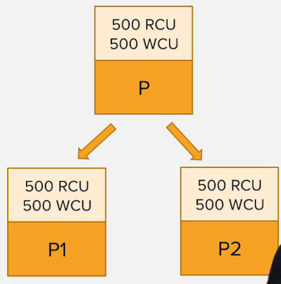

Now DynamoDB will allocate 2 new partitions, and then distribute data from our existing partition `P`, uniformly between the new partitions `p1` and `p2`, and then will de-allocate the old partition `p1`. The new provisioned Capacity will also equally distributed between the new partitions.

Note: if you scale down, you will still have 2 partitions.

Hence we must be careful when bumping up the table capacity for short tem and then bring it down. Such approach will simply create more partitions than we need. And because of that, since the provisioned capacity get equally divides between all the partitions, our table will perform at far lower throughput than desired, and the only way to increase the throughput is to increase the provisioned Capacity units, meaning more cost.

It is important that our table is designed in such way that data gets uniformly distributed across partitions.

#### 31. Basics of DynamoDB Indexes

In a `relational database`, an `index` is a data structure that lets you perform fast queries on different columns in a table. You can use the CREATE INDEX SQL statement to add an index to an existing table, specifying the columns to be indexed. After the index has been created, you can query the data in the table as usual, but now the database can use the index to quickly find the specified rows in the table instead of scanning the entire table.

First of all, DynamoDB internally creates a index based on the primary key.

Meanwhile, in DynamoDB, you can create and use a `secondary index` for similar purposes.

What makes DynamoDB so much more than just a simple Key-Value store is the secondary indexes. They allow you to quickly query and lookup items based on not only the primary index attributes, but also attributes of your choice.

Indexes in DynamoDB are different from their relational counterparts. When you create a secondary index, you must specify its key attributes—a partition key and a sort key. After you create the secondary index, you can Query it or Scan it just as you would with a table.

#### Table Index

- Partition or Hash key decides the target partition

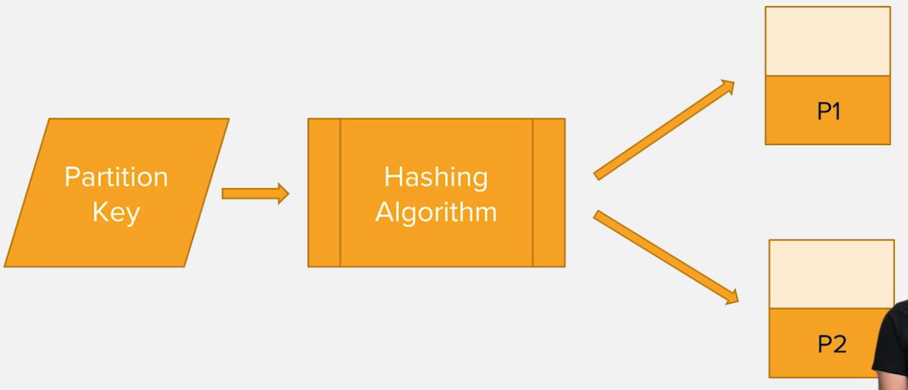

The value of the partition key is used to decide the partition in which the corresponding item should be stored.
DynamoDB does this by using what is called a hashing algorithm or hashing function. It uses the hashing function or algorithm to compute a hash of the partition key. The resulting hash values then used to determine the the partition in which the particular item would be stored.
DynamoDB stores all of the items with the same partition key physically close to each other, order by the value of sort key.

This is why you should query the table data with partition key, DynamoDB will recalculate the hash of the partition key to identify the location of the item.

#### 32. Local Secondary Indexes and Global Secondary Indexes

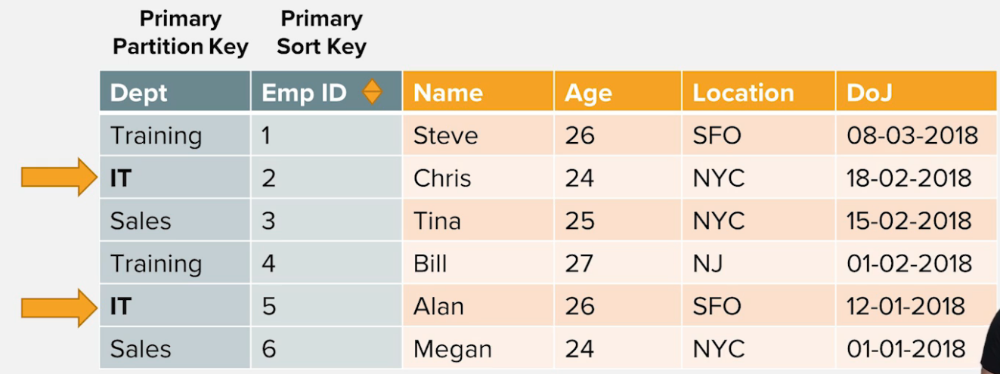
The `primary index` of a DynamoDB table is created internally by the DynamoDB, with the primary key.

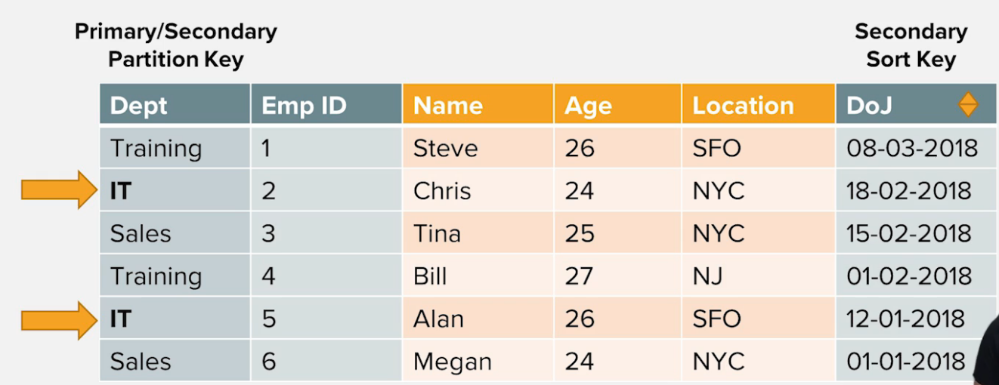
`Local Secondary Indexes` use the same hash key as the primary index but allow you to use a different sort key. In above example, the Local Secondary Indexes is using the same hash key 'Dept' attribute as the primary index, but use the 'Doj' attribute as the sort key.

You must create a Local Secondary Indexes when you create a DynamoDB table, up to 5 Local Secondary Indexes per table.

`Local Secondary Indexes` will be saved in the same partition as the base table, and share the Capacity Units with the table

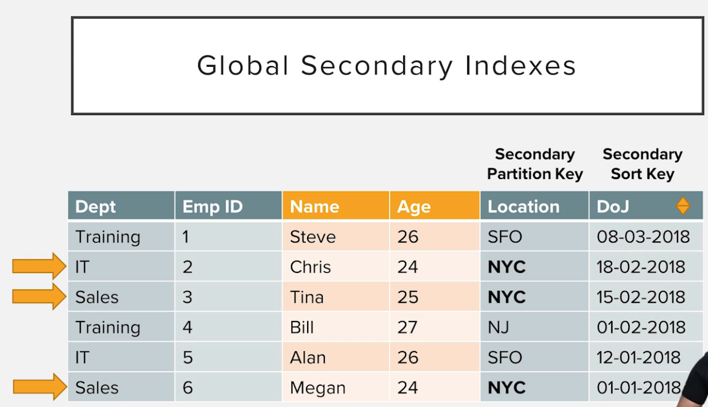
`Global Secondary Index` are much more flexible and don't have LSI limitations. They don't have to share the same hash key, and they can also be created on a table with a simple key schema. Most of the time, you'll find yourself using GSIs over LSIs because they enable much more flexible query access patterns.

`Global Secondary Index` can be created anytime(This is because Global Secondary Index are stored separately in their own partitions), up to 5 Local Secondary Indexes per table.

Since `Global Secondary Index` are stored in their own partitions, they have their own throughput as well, not shared with the Capacity Units with the base table.

However, you can only perform eventual consistency with Global Secondary Indexes. When an item is updated to the table, the Global Secondary Index is updated asynchronously in the background.

### Section 5: Working with DynamoDB using AWS Console

#### 34. Table-level Operations with AWS Console

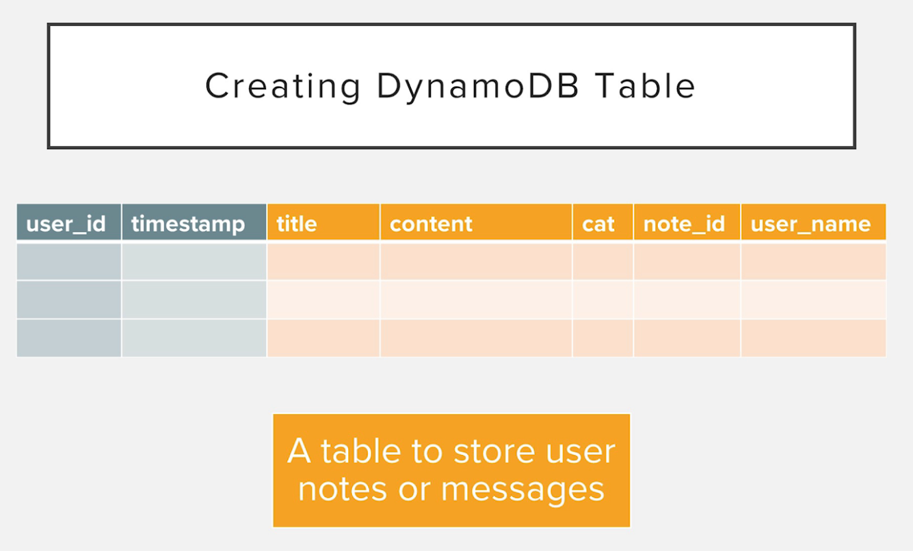
We need to create a table like above

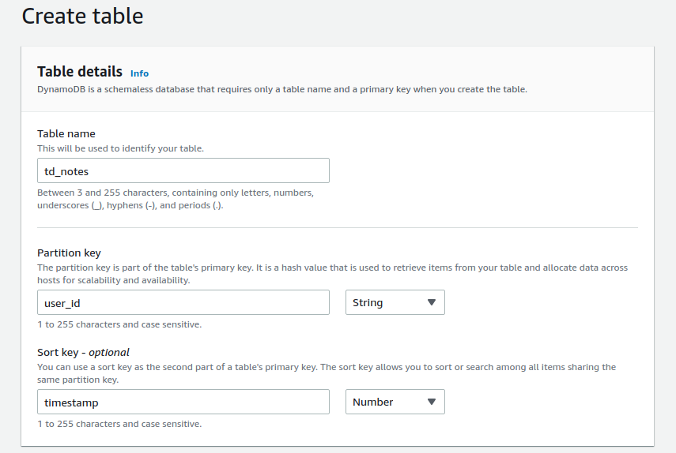
We use 'user_id' as the partition key, and 'timestamp' as sort key. It is good to have a number as sort key, but it is not a rule.

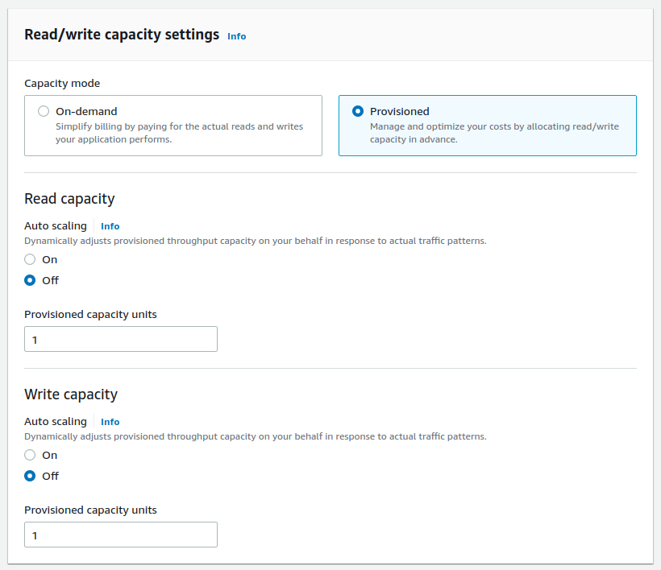

Now you can create the secondary index.
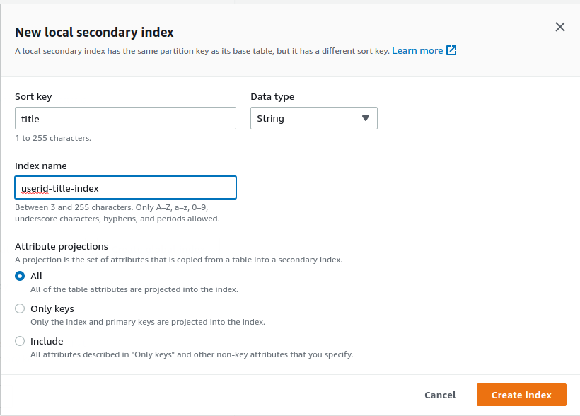
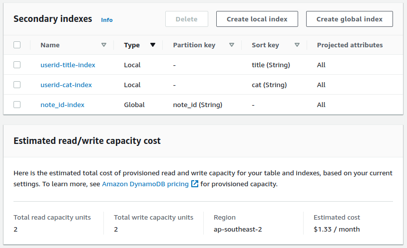

When you add a global secondary index, the total Capacity Units will increase because global secondary index has its own Capacity Units.

By default, the global secondary index's capacity is the same as your base table's capacity. You can change the index's capacity in the table's settings after you create the table.

When you click `create table` button, the dynamodb table will be created in a few seconds.

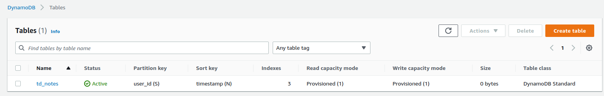

#### 35. Item-Level Operations with AWS Console

Create item

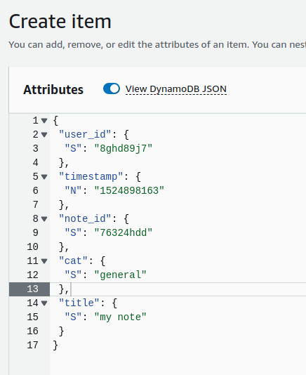

Query Item using table primary(default) index
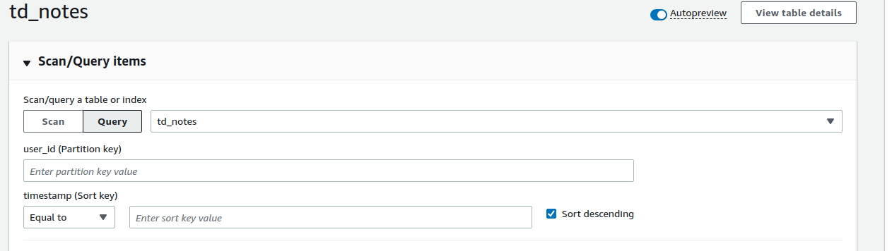

Query Item using local secondary index
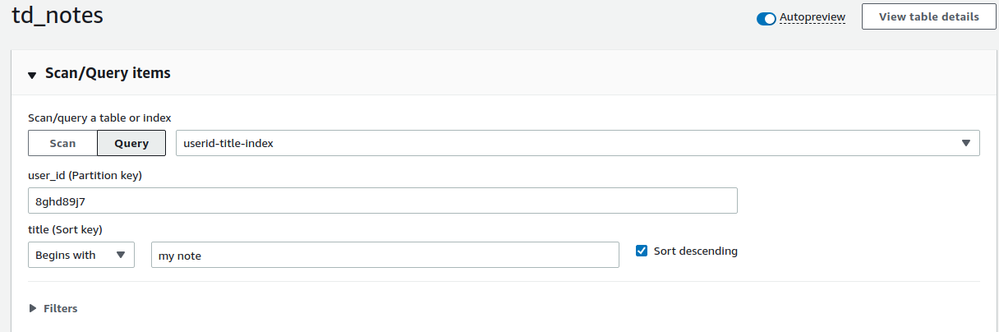

### Section 7: Working with DynamoDB using AWS SDK

`services/TableService.ts`

```ts
import { Inject, Service } from "typedi";
import { DynamoDB } from "aws-sdk";
import {
  CreateTableInput,
  DeleteTableInput,
  DescribeTableInput,
  ListTablesInput,
} from "aws-sdk/clients/dynamodb";

@Service()
export class TableService {
  constructor(@Inject("dynamoDBInstance") private dynamodb: DynamoDB) {}

  listTables = async (params: ListTablesInput = {}) => {
    return this.dynamodb.listTables(params).promise();
  };

  describeTable = async (params: DescribeTableInput) => {
    return this.dynamodb.describeTable(params).promise();
  };

  createTable = async (createTableInput: CreateTableInput) => {
    return this.dynamodb.createTable(createTableInput).promise();
  };

  deleteTable = async (deleteTableInput: DeleteTableInput) => {
    return this.dynamodb.deleteTable(deleteTableInput).promise();
  };
}
```

describeTable Output

```
tables [ 'td_notes' ]
details {
  Table: {
    AttributeDefinitions: [ [Object], [Object], [Object], [Object], [Object] ],
    TableName: 'td_notes',
    KeySchema: [ [Object], [Object] ],
    TableStatus: 'ACTIVE',
    CreationDateTime: 2022-08-25T04:11:43.813Z,
    ProvisionedThroughput: {
      NumberOfDecreasesToday: 0,
      ReadCapacityUnits: 1,
      WriteCapacityUnits: 1
    },
    TableSizeBytes: 0,
    ItemCount: 0,
    TableArn: 'arn:aws:dynamodb:ap-southeast-2:<your_user_id>:table/td_notes',
    TableId: 'XXX',
    LocalSecondaryIndexes: [ [Object], [Object] ],
    GlobalSecondaryIndexes: [ [Object] ],
    TableClassSummary: { TableClass: 'STANDARD' }
  }
}
```

createTable input

```ts
import { CreateTableInput } from "aws-sdk/clients/dynamodb";

export const createTableInput: CreateTableInput = {
  TableName: "td_notes_sdk",
  AttributeDefinitions: [
    { AttributeName: "user_id", AttributeType: "S" },
    { AttributeName: "timestamp", AttributeType: "N" },
    { AttributeName: "note_id", AttributeType: "S" },
    { AttributeName: "title", AttributeType: "S" },
    { AttributeName: "cat", AttributeType: "S" },
    // { AttributeName: "username", AttributeType: "S" },
    // { AttributeName: "content", AttributeType: "S" },
  ],
  KeySchema: [
    {
      AttributeName: "user_id",
      KeyType: "HASH",
    },
    {
      AttributeName: "timestamp",
      KeyType: "RANGE",
    },
  ],
  ProvisionedThroughput: {
    ReadCapacityUnits: 1,
    WriteCapacityUnits: 1,
  },
  LocalSecondaryIndexes: [
    {
      IndexName: "user_id_title_index",
      KeySchema: [
        {
          AttributeName: "user_id",
          KeyType: "HASH",
        },
        {
          AttributeName: "title",
          KeyType: "RANGE",
        },
      ],
      Projection: {
        ProjectionType: "ALL",
      },
    },
    {
      IndexName: "user_id_cat_index",
      KeySchema: [
        {
          AttributeName: "user_id",
          KeyType: "HASH",
        },
        {
          AttributeName: "cat",
          KeyType: "RANGE",
        },
      ],
      Projection: {
        ProjectionType: "ALL",
      },
    },
  ],
  GlobalSecondaryIndexes: [
    {
      IndexName: "note_id_index",
      KeySchema: [
        {
          AttributeName: "note_id",
          KeyType: "HASH",
        },
      ],
      Projection: {
        ProjectionType: "ALL",
      },
      ProvisionedThroughput: {
        ReadCapacityUnits: 1,
        WriteCapacityUnits: 1,
      },
    },
  ],
  StreamSpecification: {
    StreamEnabled: false,
  },
  Tags: [{ Key: "Creator", Value: "JG" }],
};
```

Note: When you create a table, all the attributes must be part of primary key, or be part of secondary indexes. Otherwise, the table creation will fail.

#### 43. Write Operations - Item Level Operations with AWS SDK

`services/TableItemService.ts`

```ts
import { Inject, Service } from "typedi";
import {
  BatchGetItemInput,
  BatchWriteItemInput,
  DeleteItemInput,
  DocumentClient,
  GetItemInput,
  PutItemInput,
  QueryInput,
  ScanInput,
  UpdateItemInput,
} from "aws-sdk/clients/dynamodb";

@Service()
export class TableItemService {
  constructor(
    @Inject("dynamoDbDocumentClient") private documentClient: DocumentClient
  ) {}

  put = (params: PutItemInput) => {
    return this.documentClient.put(params).promise();
  };

  update = (params: UpdateItemInput) => {
    return this.documentClient.update(params).promise();
  };

  get = (params: GetItemInput) => {
    return this.documentClient.get(params).promise();
  };

  batchGet = (params: BatchGetItemInput) => {
    return this.documentClient.batchGet(params).promise();
  };

  batchWrite = (params: BatchWriteItemInput) => {
    return this.documentClient.batchWrite(params).promise();
  };

  query = (params: QueryInput) => {
    return this.documentClient.query(params).promise();
  };

  scan = (params: ScanInput) => {
    return this.documentClient.scan(params).promise();
  };

  delete = (params: DeleteItemInput) => {
    return this.documentClient.delete(params).promise();
  };
}
```

1. create a new item

```ts
const res = await tableItemSvc.put({
  TableName: createTableInput.TableName,
  Item: {
    user_id: "1232",
    timestamp: 201,
  } as PutItemInputAttributeMap,
});
```

2. update an existing item (find an item with HASH KEY "1232" and RANGE KEY "200", then update its 'title' attribute value to 'Some title')

```ts
const res2 = await tableItemSvc.update({
  TableName: "td_notes_sdk",
  Key: {
    user_id: "1232",
    timestamp: 200,
  } as Key,
  UpdateExpression: "set #t = :t",
  ExpressionAttributeNames: {
    "#t": "title",
  },
  ExpressionAttributeValues: {
    ":t": "Some title",
  } as ExpressionAttributeValueMap,
});
```

3. delete an existing item (find an item with HASH KEY "1232" and RANGE KEY "2001", then delete it)

```ts
const res3 = await tableItemSvc.delete({
  TableName: "td_notes_sdk",
  Key: {
    user_id: "1232",
    timestamp: 201,
  } as Key,
});
```

4. batchWrite - Puts or deletes multiple items in one or more tables. In below example, it deletes an item from "td_notes_sdk" table, and put 2 new items in "td_notes_sdk" table

```ts
const res4 = await tableItemSvc.batchWrite({
  RequestItems: {
    td_notes_sdk: [
      {
        DeleteRequest: {
          Key: {
            user_id: "1232",
            timestamp: 200,
          } as Key,
        },
      },
      {
        PutRequest: {
          Item: {
            user_id: "new_user_id_01",
            timestamp: 100,
          } as PutItemInputAttributeMap,
        },
      },
      {
        PutRequest: {
          Item: {
            user_id: "new_user_id_02",
            timestamp: 200,
          } as PutItemInputAttributeMap,
        },
      },
    ],
  },
});
```

#### 43. Conditional Writes - Item Level Operations with AWS SDK

5. put - update item if condition is found.

Note: You cannot update primary key(both HASH key and RANGE key)!!
(You will get an error: ConditionalCheckFailedException: The conditional request failed)

```ts
const res6 = await tableItemSvc.put({
  TableName: "td_notes_sdk",
  Item: {
    user_id: "new_user_id_02",
    timestamp: 200,
    title: "some title",
    content: "init content",
  } as PutItemInputAttributeMap,
  ConditionExpression: "#t = :t",
  ExpressionAttributeNames: {
    "#t": "timestamp",
  },
  ExpressionAttributeValues: {
    ":t": 200,
  } as ExpressionAttributeValueMap,
});
```

#### 46. Read Operations - Item Level Operations with AWS SDK

7. Get

```ts
const res1 = await tableItemSvc.get({
  TableName: "td_notes_sdk",
  Key: {
    user_id: "1232",
    timestamp: 201,
  } as Key,
});
```

Output

```
{
  Item: {
    content: 'init content',
    user_id: 'new_user_id_01',
    title: 'some title',
    timestamp: 100
  }
}
```

8. Query

```ts
const res7 = await tableItemSvc.query({
  TableName: "td_notes_sdk",
  KeyConditionExpression: "#t = :t",
  ExpressionAttributeNames: {
    "#t": "user_id",
  },
  ExpressionAttributeValues: {
    ":t": "new_user_id_01",
  } as ExpressionAttributeValueMap,
});
```

or

```ts
const res7 = await tableItemSvc.query({
  TableName: "td_notes_sdk",
  KeyConditionExpression: "user_id = :t",
  ExpressionAttributeValues: {
    ":t": "new_user_id_01",
  } as ExpressionAttributeValueMap,
});
```

Output

```
{
  Items: [
    {
      content: 'init content',
      user_id: 'new_user_id_01',
      title: 'some title',
      timestamp: 100
    }
  ],
  Count: 1,
  ScannedCount: 1
}
```

9. Scan (can with or without filter)

```ts
const res8 = await tableItemSvc.scan({
  TableName: "td_notes_sdk",
  FilterExpression: "title = :title",
  ExpressionAttributeValues: {
    ":title": "some title",
  } as ExpressionAttributeValueMap,
});
```

Output

```
{
  Items: [
    {
      content: 'init content',
      user_id: 'new_user_id_03',
      title: 'some title',
      timestamp: 200
    },
    {
      content: 'init content',
      user_id: 'new_user_id_02',
      title: 'some title',
      timestamp: 200
    },
    {
      content: 'init content',
      user_id: 'new_user_id_01',
      title: 'some title',
      timestamp: 100
    }
  ],
  Count: 3,
  ScannedCount: 3
}
```

10. batchGet, get multiple items from multiple tables

```ts
const res9 = await tableItemSvc.batchGet({
  RequestItems: {
    td_notes_sdk: {
      Keys: [
        {
          user_id: "new_user_id_02",
          timestamp: 200,
        } as Key,
        {
          user_id: "new_user_id_01",
          timestamp: 100,
        } as Key,
      ],
    },
  },
});
```

Output

```
{
  "Responses": {
    "td_notes_sdk": [
      {
        "content": "init content",
        "user_id": "new_user_id_02",
        "title": "some title",
        "timestamp": 200
      },
      {
        "content": "init content",
        "user_id": "new_user_id_01",
        "title": "some title",
        "timestamp": 100
      }
    ]
  },
  "UnprocessedKeys": {}
}
```

#### 47. Paginated Reads - Item Level Operations with AWS SDK

By default, the amount of data of Query or Scan can return is limited to 1MB per request.

What if we need more data beyond this limitation?

DynamoDB has an attribute `LastEvaluatedKey`. If it has value, then you can use it as `ExclusiveStartKey` of the Subsequent query to get the next page of data. If `LastEvaluatedKey` is null, means it doesn't have any more data.

```ts
const res9 = await tableItemSvc.scan({
  TableName: "td_notes_sdk",
  Limit: 1,
});
```

Output

```
{
  "Items": [
    {
      "content": "init content",
      "user_id": "new_user_id_03",
      "title": "some title",
      "timestamp": 200
    }
  ],
  "Count": 1,
  "ScannedCount": 1,
  "LastEvaluatedKey": {
    "user_id": "new_user_id_03",
    "timestamp": 200
  }
}
```

Because the `LastEvaluatedKey` is not null, means it has more data paginated

```ts
let startKeysOfNextScan: Key | undefined;
let endKeysFromLastScan: Key | undefined;
let results: ItemList = [];
const initialScan = await tableItemSvc.scan({
  TableName: "td_notes_sdk",
  Limit: 1,
});
if (initialScan.Items?.length) {
  results = [...results, ...initialScan.Items];
}

startKeysOfNextScan = endKeysFromLastScan = initialScan.LastEvaluatedKey;

while (!!endKeysFromLastScan) {
  const SubsequentScan = await tableItemSvc.scan({
    TableName: "td_notes_sdk",
    Limit: 1,
    ExclusiveStartKey: startKeysOfNextScan,
  });
  if (SubsequentScan.Items?.length) {
    results = [...results, ...SubsequentScan.Items];
  }
  startKeysOfNextScan = endKeysFromLastScan = SubsequentScan.LastEvaluatedKey;
}

console.log("final", JSON.stringify(results, null, 2));
```

Output

```
 [
  {
    "content": "init content",
    "user_id": "new_user_id_03",
    "title": "some title",
    "timestamp": 200
  },
  {
    "content": "init content",
    "user_id": "new_user_id_02",
    "title": "some title",
    "timestamp": 200
  },
  {
    "content": "init content",
    "user_id": "new_user_id_01",
    "title": "some title",
    "timestamp": 100
  }
]
```
